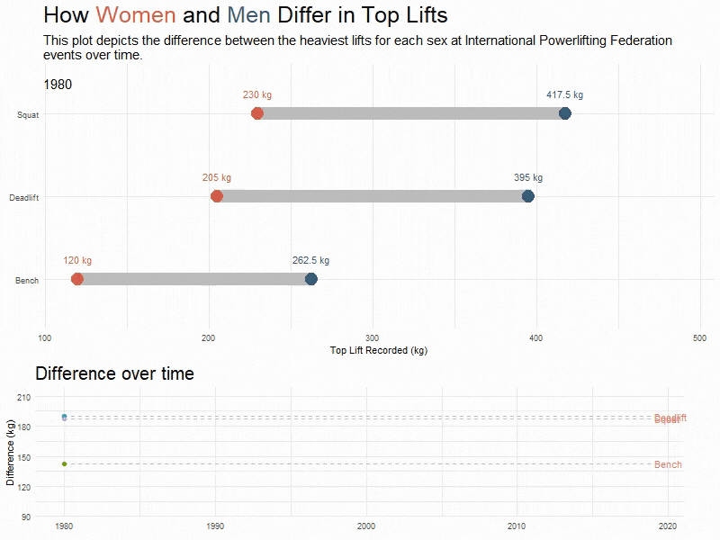

 

# Weightlifting Gender Gap 

> The aim of this project is to identify the gap between weightlifting by gender.

## ✨  Output
The final output looks like this:

  

## ✨ Contribution

Contributions, issues, and feature requests are welcome!

To contribute to this project, see the GitHub documentation on **[creating a pull request](https://help.github.com/en/github/collaborating-with-issues-and-pull-requests/creating-a-pull-request)**.

---

## 👏 Support

Give a ⭐️ if you like this project!

## 📝 Feedback

If you have any feedback or ideas to improve this project, feel free to contact me via

___________________________________

&copy; 2021 Leah Nguyen

